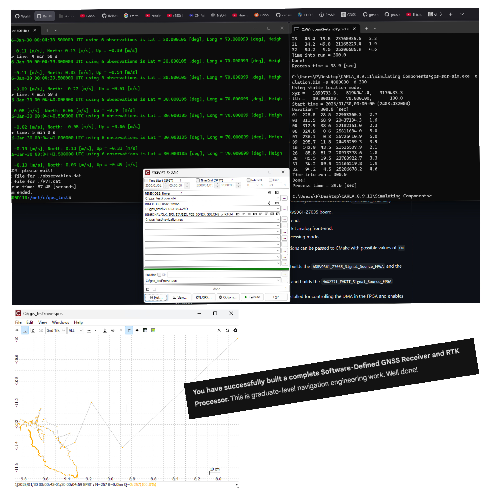

# Autonomous RTK Localization: Cross-Platform GNSS Simulation Pipeline

## System Architecture & Objective
This repository details a cross-platform pipeline designed to simulate, process, and validate Real-Time Kinematic (RTK) positioning for autonomous systems. By generating synthetic baseband signals and processing them through a software-defined receiver, this system successfully demonstrates a static localization variance of **< 5 centimeters**.

The architecture bridges Windows and Linux environments to leverage the best open-source radio and positioning tools available:
* **Signal Generation (Windows CMD):** `gps-sdr-sim`
* **Software Receiver (WSL / Ubuntu):** `gnss-sdr`
* **Kinematic Processing (Windows GUI):** `RTKLIB` (RTKPOST & RTKPLOT)

---

## Reproducing the Simulation

### Prerequisites
* A Windows environment with WSL (Ubuntu) installed.
* [gps-sdr-sim](https://github.com/osqzss/gps-sdr-sim) compiled for Windows.
* [GNSS-SDR](https://gnss-sdr.org/) installed within the WSL environment.
* [RTKLIB](https://github.com/tomojitakasu/RTKLIB) installed on Windows.
* A broadcast ephemeris file (e.g., `brdc0300.26n`).

### Phase 1: Baseband Signal Generation (Windows)
Generate the raw binary signal files (`.bin`) for both a moving/target Rover and a static Base Station.

Open a Windows Command Prompt, navigate to your simulator directory, and execute the following to simulate a 5-minute signal at a 4 MHz sampling rate:

**1. Generate Rover Signal (Target: 30.0, 70.0)**
```cmd
gps-sdr-sim.exe -e brdc0300.26n -l 30.0,70.0,100 -o C:\gps_test\simulation_standard.bin -s 4000000 -d 300
```

**2. Generate Base Station Signal (Reference: 30.0001, 70.0001)**
```cmd
gps-sdr-sim.exe -e brdc0300.26n -l 30.0001,70.0001,100 -o C:\gps_test\base_simulation.bin -s 4000000 -d 300
```

### Phase 2: SDR Processing - Rover (WSL)
Transition to the WSL Ubuntu environment to process the binary files into standard RINEX observation files.

**1. Configure the Receiver:** Open the configuration file using Nano:
```bash
sudo nano /usr/share/gnss-sdr/conf/gnss-sdr_GPS_L1_ishort.conf
```
* Update Input (`SignalSource.filename`): `/mnt/c/gps_test/simulation_standard.bin`
* Update Output (`[PVT] output_filename`): `/mnt/c/gps_test/rover.obs`

**2. Execute the SDR:**
```bash
gnss-sdr --config_file=/usr/share/gnss-sdr/conf/gnss-sdr_GPS_L1_ishort.conf
```
*(Allow the process to run for approximately 60 seconds to accumulate sufficient satellite locks, then terminate with `Ctrl+C`)*

**3. Isolate Navigation Data:** Rename the auto-generated `.26N` file for clarity:
```bash
mv /mnt/c/gps_test/*.26N /mnt/c/gps_test/navigation.nav
```

### Phase 3: SDR Processing - Base Station (WSL)
Repeat the SDR processing for the base station to generate the reference observation file.

**1. Update Configuration:** Open the same config file:
```bash
sudo nano /usr/share/gnss-sdr/conf/gnss-sdr_GPS_L1_ishort.conf
```
* Update Input (`SignalSource.filename`): `/mnt/c/gps_test/base_simulation.bin`
* Update Output (`[PVT] output_filename`): `/mnt/c/gps_test/base.obs`

**2. Execute the SDR:**
```bash
gnss-sdr --config_file=/usr/share/gnss-sdr/conf/gnss-sdr_GPS_L1_ishort.conf
```
*(Terminate after ~60 seconds with `Ctrl+C`)*

### Phase 4: RTK Kinematic Resolution (Windows)
With the RINEX files successfully generated, transition back to Windows to compute the high-precision solution.

1. Launch **RTKPOST**.
2. **Input File Selection:**
   * **Rover:** `C:\gps_test\rover.obs`
   * **Base Station:** `C:\gps_test\base.obs`
   * **NAV Data:** `C:\gps_test\navigation.nav`
3. **Spatial Configuration (Crucial):** * Navigate to **Options -> Positions**.
   * Set the Base Station format to **Lat/Lon/Height**.
   * Inject the exact coordinates used in Phase 1: `30.0001, 70.0001, 100.0`.
4. **Execution:** * Click **Execute** to generate the spatial solution (`.pos`).
   * Click **Plot** to view the accuracy graph in RTKPLOT.

---

## Results & Validation
Visualizing the output data via **RTKPLOT** reveals Phase-Carrier Ambiguity Resolution (RTK Fix). The resulting scatter plot for the North/East/Up coordinates confirms an error radius securely within the **0.05m (5cm)** threshold, mathematically validating the localization logic for hardware deployment.



## 🤝 Acknowledgments
This architecture utilizes the core engines of the following open-source projects:
* [gps-sdr-sim](https://github.com/osqzss/gps-sdr-sim) by osqzss.
* [GNSS-SDR](https://gnss-sdr.org/) by the CTTC open-source community.
* [RTKLIB](https://github.com/tomojitakasu/RTKLIB) by Tomoji Takasu.
